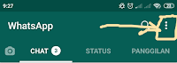

Bosan dengan tampilan whatsapp yang putih ? kini whatsapp sudah tersedia dengan tampilan mode gelap yang pasti membuat kamu tidak bosan lagi.  
  
WhatsApp adalah aplikasi pesan untuk ponsel cerdas dengan basic mirip BlackBerry Messenger. WhatsApp memiliki fitur untuk mengirim gambar, video, suara, dan lokasi GPS.  
  

## Cara Mode Gelap Whatsapp

*   Buka aplikasi **Whatsapp**.
*   Pilih **titik tiga vertikal** di kanan atas.

    

*   Pilih **Setelan**.

*   Pilih **Chat**.

*   Pilih **Tema**.

*   Disini ada opsi **Terang** dan **Gelap**, silakan pilih **Gelap** dan Pilih **Oke**.

*   kini tampilan **Whatsapp** Anda sudah menjadi **Mode Gelap**.

Jika kurang jelas atau kurang mengerti bisa lihat video berikut ini

<iframe width="560" height="315" src="https://www.youtube.com/embed/9OiufkaF1VM" title="YouTube video player" frameborder="0" allow="accelerometer; autoplay; clipboard-write; encrypted-media; gyroscope; picture-in-picture" allowfullscreen></iframe>

Demikianlah **Cara Mode Gelap Whatsapp Dengan Mudah**, semoga bermanfaat dan membantu Anda. Sampai jumpa di PanduanPur lainnya.