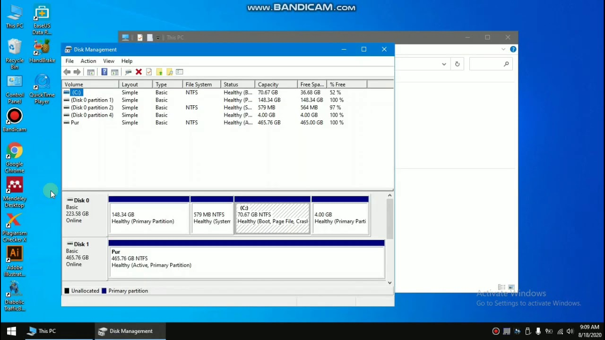

Apakah masalah Anda adalah HardDisk eksternal tidak terbaca di Disk Management? jangan berpikir itu sudah rusak atau mempertimbangkan untuk membeli yang baru. Karena harddisk eksternal tersebut belum tentu rusak dan masih bisa di perbaiki.

HardDisk eksternal adalah salah satu pilihan banyak orang untuk membackup data-data penting, diantaranya seperti program, dokumen, gambar, musik, dan video. HardDisk eksternal dibutuhkan agar data-data penting tetap aman jika ada masalah yang tidak diinginkan terjadi, seperti hardisk utama terkena virus, data tidak sengaja terhapus, hardisk utama rusak.

## Penyebabnya

Namun masih banyak orang yang mengalami masalah saat menggunakan harddisk eksternal terbaca tapi tidak bisa dibuka. Salah satunya adalah hardisk external tidak terbaca di explorer Ada banyak kemungkinan penyebabnya, termasuk virus, status _Unknown Not Initialized_, dan kerusakan harddisk eksternal.

## ini adalah cara termudah yaitu melalui Disk Management.

1.  Klik kanan pada logo **Windows** letaknya di pojok kiri bawah.

2.  Kemudian pilih **Disk Management**.

3.  Klik kanan pada partisi disk yang tidak memiliki huruf drive.

4.  Pilih **Change Drive Letter and Paths**.

5.  Klik pada tombol **Add** di jendela pop-up.

6.  Tetapkan **Huruf Drive** ke partisi bebas mau yang mana dan klik **OK** untuk mengonfirmasi.

7.  Cek apakah hardisk eksternal terbaca.

## Solusi Lainnya

Jika cara diatas tidak berhasil bisa mengikuti saran dibawah ini.

1.  Cek Hard Disk tersebut di komputer atau laptop lain.

2.  Cek casing Hard Disk eksternal apakah ada yang rusak, bisa pinjam casingnya di temen atau beli yang baru.

3.  Cek Slot USB komputer atau laptop, bisa dengan mencolokan USB mouse atau keyboard untuk memastikannya.

4.  Update driver Hard Disk, buka **Device Manager** cari tulisan **Universal Serial Bus Controllers** lalu Klik kanan dan pilih **Update Driver Software**.

5.  uninstall driver Hard Disk, caranya hampir sama seperti diatas hanya saja pilih **uninstall**.

## Video Mengatasi HardDisk Eksternal Tidak Terbaca

Jika masih belum paham silakan lihat video di bawah ini

<iframe width="560" height="315" src="https://www.youtube.com/embed/RGPtyd3Kix4" title="YouTube video player" frameborder="0" allow="accelerometer; autoplay; clipboard-write; encrypted-media; gyroscope; picture-in-picture" allowfullscreen></iframe>

## Penutup

Oke, itu dia, cara mengatasi harddisk eksternal tidak terbaca di windows. Saya harap tutorial ini dapat membantu Anda sehingga harddisk terbaca kembali. Sampai jumpa di postingan saya yang lainnya.