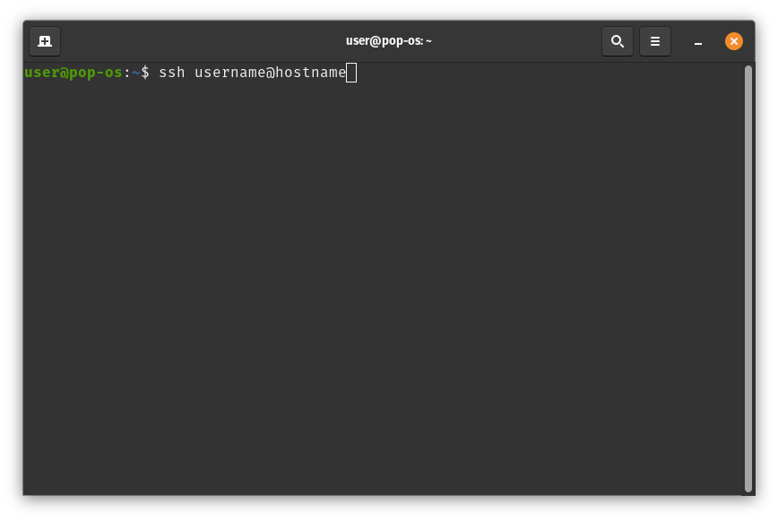

SSH (Secure Shell) adalah protokol jaringan yang digunakan untuk mengakses server secara aman. Dengan menggunakan [SSH](https://wappur.my.id/tags/ssh/), dapat mengakses server dari jarak jauh dan menjalankan berbagai perintah. Ini adalah cara yang aman untuk mengakses server dan mengelola [file](https://wappur.my.id/tags/file/) dan folder.

Untuk login ke [server](https://wappur.my.id/tags/server/) melalui SSH, harus memiliki akun SSH yang dikonfigurasi. Jika belum memiliki akun SSH, harus membuatnya terlebih dahulu. Setelah memiliki akun SSH, dapat menggunakan terminal untuk login ke server.

Untuk login ke server melalui [terminal](https://wappur.my.id/tags/terminal/), harus mengetikkan perintah berikut:

<code>ssh username@hostname</code>

Di sini, username adalah nama pengguna akun SSH dan [hostname](https://wappur.my.id/tags/hostname/) adalah alamat IP atau nama [domain](https://wappur.my.id/tags/domain/) server. Setelah mengetikkan perintah ini, akan diminta untuk memasukkan kata sandi akun SSH. Jika memasukkan kata sandi yang benar, akan berhasil login ke server.

Setelah berhasil login ke [server](https://wappur.my.id/tags/server/), dapat menjalankan berbagai perintah untuk mengelola file dan folder di server. Juga dapat menggunakan terminal untuk mengakses server dari jarak jauh.

Ini adalah [tutorial](https://wappur.my.id/tags/tutorial/) singkat tentang cara login ke server melalui SSH di terminal. Dengan menggunakan SSH, dapat mengakses server dari jarak jauh dan mengelola file dan folder di server [Linux](https://wappur.my.id/tags/linux/). Jika belum memiliki akun SSH, harus membuatnya terlebih dahulu. Setelah memiliki akun SSH, dapat menggunakan terminal untuk login ke server.