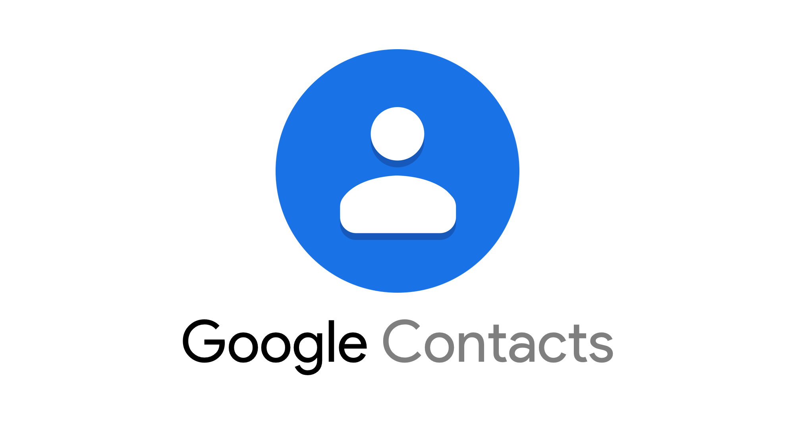

Kontak Google adalah alternatif yang bagus untuk Kontak iCloud untuk menyinkronkan kontak antara iPhone atau iPhone dan Android. Namun, mungkin akan bingung jika menggunakan keduanya di iPhone. dapat menghapus Google Kontak dari iPhone jika ingin menyelaraskannya hanya dengan akun iCloud.

Ada beberapa cara untuk menghapus Google Kontak dari iPhone. Untuk memulai, perlu mematikan sinkronisasi untuk Google Kontak di Pengaturan. Itu akan menghentikan sinkronisasi kontak dari Google Kontak ke iPhone, dan jika telah memilih Google Kontak sebagai lokasi penyimpanan kontak default, itu akan diubah ke iCloud.

<ins class="adsbygoogle"
     style="display:block; text-align:center;"
     data-ad-layout="in-article"
     data-ad-format="fluid"
     data-ad-client="ca-pub-5738026098468973"
     data-ad-slot="3197019226"></ins>

Jika ingin menghindari sinkronisasi kontak baru ke Google Kontak, harus mengubah akun default iPhone. Selanjutnya, jika hanya ingin melihat kontak iPhone dan menyembunyikan Google Kontak, dapat melakukannya tanpa menghapus Kontak Google dari iPhone. Posting ini mencakup semua itu.

Mari kita lihat cara menghentikan sinkronisasi Google Kontak ke iPhone.

> **CATATAN**: Metode berikut juga akan berfungsi di Apple iPad.

## CARA MENONAKTIFKAN SINKRONISASI KONTAK GOOGLE DI IPHONE

Metode ini akan menghapus semua Kontak Google dari iPhone. Untuk melakukannya, ikuti langkah-langkah berikut:

**Langkah 1**: Buka Pengaturan di iPhone.

**Langkah 2**: Buka Kontak. Ketuk Akun.

[

**Langkah 3**: Ketuk Gmail.

**Langkah 4**: Matikan sakelar di sebelah Kontak untuk akun Google. iOS akan mengingatkan bahwa Google Kontak akan dihapus dari ponsel. Konfirmasikan saat ditanya.

Saat mematikan sinkronisasi untuk Google Kontak di iPhone, Google Kontak akan dihapus hanya dari iPhone. Artinya, mereka akan menghilang dari aplikasi Kontak, dan tidak akan dapat mengaksesnya dari iPhone.

Namun, bukan berarti kontak akan dihapus dari semua perangkat. masih dapat mengaksesnya dari https://contacts.google.com di web atau perangkat lain yang menambahkan akun Google. Menonaktifkan Google Kontak di iPhone tidak akan memengaruhi data lain dari akun Google, seperti catatan, kalender, dll., Kecuali dan hingga matikan yang tersedia di sebelahnya dihidupkan.

## CARA MENGHAPUS BEBERAPA KONTAK GOOGLE DARI IPHONE

Jika hanya ingin menghapus beberapa Google Kontak dari iPhone, harus menghapusnya. Menghapusnya di iPhone juga akan menghapusnya dari semua perangkat. Jadi berhati-hatilah sebelum menggunakan metode ini.

Anda dapat menggunakan metode ini jika ingin Kontak Google tetap di iPhone tetapi dalam mode siluman. Artinya, harus dapat melihatnya hanya saat membutuhkannya. Dengan kata lain, sembunyikan Kontak Google di iPhone tanpa menghapus atau mematikan sinkronisasi.

Berikut cara menyembunyikan dan menghapus beberapa Google Kontak dari iPhone.

**Langkah 1**: Buka aplikasi Kontak Apple di iPhone.

**Langkah 2**: Ketuk opsi Grup di bagian atas.

**Langkah 3**: akan melihat berbagai grup kontak di sini. Pada dasarnya, kontak dari berbagai layanan dikategorikan ke dalam berbagai grup, termasuk satu dari Gmail. Jadi jika ingin menyembunyikan Google Kontak dari aplikasi Kontak, hapus centang pada kotak di samping Semua Gmail.

Jika ingin menghapus beberapa Google Kontak, hapus centang pada kotak di samping semua grup lain kecuali Gmail sehingga hanya Google Kontak yang terlihat. Jika itu terjadi, buka layar utama aplikasi Kontak dan hapus kontak seperti biasa. Artinya, buka kontak yang ingin hapus. Ketuk Edit. Gulir ke bawah dan tekan Hapus Kontak. Ulangi langkah tersebut untuk kontak lainnya.

## CARA BERHENTI MENYINKRONKAN KONTAK DARI IPHONE KE KONTAK GOOGLE

Untuk menyimpan kontak baru ke layanan yang berbeda dari Google Kontak, perlu mengubah akun default di pengaturan.

Untuk itu, ikuti langkah-langkah berikut:

**Langkah 1**: Buka Pengaturan di iPhone. Buka Kontak.

**Langkah 2**: Ketuk Akun Default. Centang kotak di samping iCloud atau layanan lain selain Gmail.

Jika hanya mengubah akun default tanpa mematikan sinkronisasi Google Kontak seperti yang ditunjukkan di atas, maka kontak yang ada dari Google Kontak akan tetap muncul di iPhone.

## BACKUP KONTAK

Kami berharap dapat menghapus Google Kontak dari iPhone. Menghapus Kontak Google akan menempatkan semua fokus pada Kontak iCloud jika tidak ada layanan lain yang ditambahkan. Itu juga harus dalam memperbaiki masalah yang terkait dengan Kontak iCloud. Agar lebih aman, sebaiknya mencadangkan kontak ke Google Drive secara teratur.